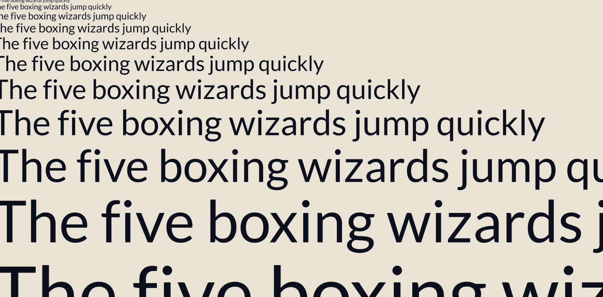

# windfoil



Code and demos for _windfoil_, a method for filling 2D vector shapes built from quadratic-Bézier contours, by computing winding and analytic anti-aliasing per-pixel in a fragment shader. The algorithm was designed to improve upon the public [Slug Algorithm](https://terathon.com/blog/decade-slug.html) for certain uses cases.

> 🚩 This builds on prior work (Slug, Vello, Pathfinder, font-rs and others), and may or may not be a novel algorithm. The core of the algorithm was designed by Code Claude on Fable after a ~1.5 hour uninterrupted session within a larger codebase I am working on, although it required several more hours and design/code iterations to tune performance and bugs (see [How This Came About](#how-this-came-about)). It's entirely possible this algorithm collides with an existing technique in its memory, or perhaps even a patent. After searching, I haven't been able to find any other algorithms or code that approaches vector rendering in the same way, but more research would be needed to be sure, so use this at your own risk.

## Web Demo

You can see a demo of this here:

## Running Locally

Requires [Deno](https://deno.com/) 2.x on a machine with a WebGPU-capable GPU.

```sh
# renders a PNG in output/
deno task render

# compare against point-sampled box filter and Skia
deno task validate

# serve the demo, then open http://localhost:8080/
deno task serve
```

Note: this repo refers to "Skia" but is actually using [`@napi-rs/canvas`](https://www.npmjs.com/package/@napi-rs/canvas) as a reference, which uses Skia under the hood.

## What's here

This README was written by me, but most of the code and other documentation in the repo was produced by agents at my direction.

- [`docs/ALGORITHM.md`](docs/ALGORITHM.md) — the algorithm
- [`docs/NOTES.md`](docs/NOTES.md) — some additional properties of the algorithm I've found interesting for my own uses.
- [`src/windfoil.wgsl`](src/windfoil.wgsl) — the shader: the winding-integral box filter + the row-band gather.
- [`src/bands.js`](src/bands.js) — the row-band acceleration structure
- [`src/font.js`](src/font.js) — glyph outlines + metrics from the bundled font (using opentype.js).

## How This Came About

To provide a little context, I have been working for some weeks now on a 2D vector engine largely built on the [Slug Algorithm](https://terathon.com/blog/decade-slug.html) (which is great, but primarily developed for text and icons). My goal has been "perfectly" anti-aliased vector graphics at all resolutions for high quality print artwork (e.g. 30k x 30k PNG files), while supporting a range of complex paths, strokes, and per-pixel effects for generative art. You can see two demos of the engine [here](https://x.com/mattdesl/status/2070470499772080512) and [here](https://x.com/mattdesl/status/2071199412785684630), alongside some other posts I've made on X/Twitter about it.

I tasked Fable with solving some problems I was encountering, and it was able to work within the large codebase I had been developing (I had a number of profilers, fuzzers and harnesses already in place across Rust/WASM, JS, Figma's renderer, and Skia via `@napi-rs/canvas`). Some notes & findings:

- Slug uses a dual-ray approach, splitting shapes into horizontal and vertical bands (each pixel walks two bands), and in some complex scenes I was finding performance bottlenecks in shader reads and storage. The single-ray winding integral approach brought the bands buffer from ~1.54 MB to ~0.84 MB in the [tiger test SVG](https://commons.wikimedia.org/wiki/File:Ghostscript_Tiger.svg) and per-frame time did not regress, but improved in most scenes I tested.
- Broadly, Slug's AA assumes ~one edge per pixel, so self overlapping strokes would sometimes render with degraded AA. To correct this, I had a CPU sweep union prepass to ensure each fragment received a single edge. Whereas windfoil's integral handles overlap for free, so I was able to remove most of the CPU processing and just operate on the curves directly. This was a huge performance win for some generative art scenes with hundreds of thousands of complex and overlapping strokes, and also meant that more of my shapes became naturally scale invariant (as the CPU preprocessing was flattening curves at a device scale).
- Both Slug and Skia's anti-aliasing could be described as approximations of the box filter, but windfoil computes it (nearly) exactly in all cases I tested and care about. It was 4.2x closer to box filter against a 16x supersampled ground truth, and across a ~1000 shape corpus it was ~13% closer to Skia than Slug (Δ 0.164/255 for windfoil vs 0.189 for Slug, and every outlier improved). It tied Slug only on the pathological pixels containing three-plus overlapping winding levels, which as far as I understand no single-sample approach can handle.
- I was struggling to get a per-cell "backdrop" across shapes, to further optimise complex scenes. With this algorithm, it was made much simpler, and I can precompute an exact integer winding of everything outside of a cell (the 'backdrop').
- This algorithm also opens some other interesting new avenues for my renderer that were not easy with Slug, such as plugging in new AA kernels (e.g. tent, Mitchell–Netravali) and computing curve normals, see [`docs/NOTES.md`](./docs/NOTES.md)

## AI Usage

I've left much of the LLM-generated documents and code alone in this repo, although it has gone through many rounds of iterations (the first draft of the algorithm had some issues). If this is truly a novel approach, which I am still not entirely sure of, it does present to me an interesting example of AI interpolating and recombining existing ideas to form something new, and as such it seems fitting to let the AI mostly speak for itself in some of the code & documents (em dashes and all). The original name that Fable gave the algorithm was "Area Algorithm," which felt a little dull. I've gone with _windfoil_, a sport I've never done but would like to try one day, and that seemed well suited given the winding computation and the light and airy properties the term evokes.

## Prior Art

- [font-rs](https://github.com/raphlinus/font-rs) — Raph Levien's signed-area scanline rasterizer ([writeup](https://medium.com/@raphlinus/inside-the-fastest-font-renderer-in-the-world-75ae5270c445))
- [Pathfinder](https://github.com/servo/pathfinder) — Patrick Walton's GPU vector/font rasterizer
- [Vello](https://github.com/linebender/vello) — GPU compute-centric 2D renderer (Linebender)
- [Slug](https://sluglibrary.com/) — Eric Lengyel's dual-ray analytic per-pixel coverage (JCGT 2017)
- [Easy Scalable Text Rendering on the GPU](https://medium.com/@evanwallace/easy-scalable-text-rendering-on-the-gpu-c3f4d782c5ac) — Evan Wallace's atlas-free outline gather
- [Random-Access Vector Graphics](https://hhoppe.com/proj/ravg/) — Nehab & Hoppe, per-cell curve lattice (2008)
- [Valve SDF](https://steamcdn-a.akamaihd.net/apps/valve/2007/SIGGRAPH2007_AlphaTestedMagnification.pdf) — Chris Green, distance-field text (2007)
- [msdfgen](https://github.com/Chlumsky/msdfgen) — Viktor Chlumský, multi-channel SDF atlases

## Cite This

If you reference this work, you can cite it as:

> Matt DesLauriers. _Windfoil: per-pixel winding and analytic anti-aliasing for 2D vector shapes._ 2026. https://github.com/texel-org/windfoil

```bibtex
@misc{deslauriers2026windfoil,
  author       = {DesLauriers, Matt},
  title        = {Windfoil: per-pixel winding and analytic anti-aliasing for 2D vector shapes},
  year         = {2026},
  howpublished = {\url{https://github.com/texel-org/windfoil}}
}
```

## License

Apache-2.0 — see [`LICENSE`](LICENSE). This repository bundles the Lato font (SIL OFL 1.1), see
[`assets/OFL.txt`](assets/OFL.txt).
