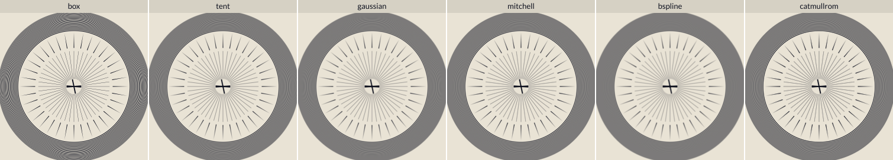
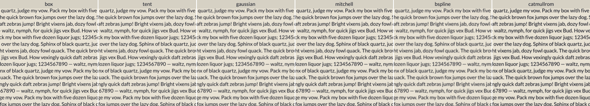
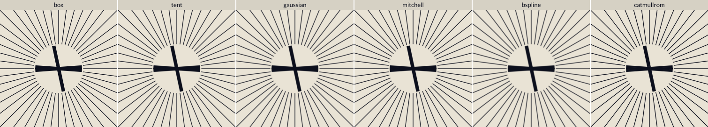
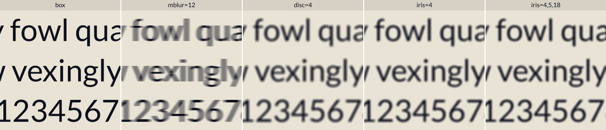
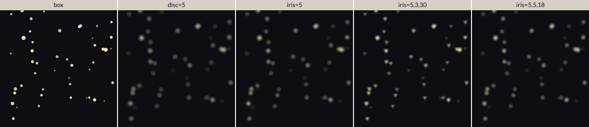

# Pluggable Filter Kernels

> 🤖 This document was primarily generated by LLM agents, with revisions by the author. See the README for more details on AI usage.

The windfoil shader computes the **exact box filter** of the winding number — and nothing in its derivation
actually depends on the box. [`NOTES.md`](NOTES.md) § *Filter Kernels* sketches the generalization; this
branch builds it: the coverage filter becomes a **rendering choice**, selected per pipeline, with the box
remaining the untouched default.

```sh
deno task render --kernel gaussian              # the PNG ladder under a truncated Gaussian
deno run --unstable-webgpu -A bench/kernels.js  # per-kernel cost ladders vs the box baseline
deno run --unstable-webgpu -A bench/kernels.js --montage   # labeled side-by-side comparison strips
deno task validate-kernels                      # every kernel vs an independent ground truth
deno task serve                                 # then open localhost:8080/?kernel=mitchell  (or mblur=8, disc=2, iris=3 …)
```

The API is one function: `loadKernelShaderCode(name)` in [`src/kernels.js`](../src/kernels.js) returns WGSL
for `createGlyphRenderer`. `'box'` returns [`src/windfoil.wgsl`](../src/windfoil.wgsl) byte-for-byte; anything
else returns [`src/windfoil-ext.wgsl`](../src/windfoil-ext.wgsl) with that kernel's block spliced in. A kernel
is a **pipeline**, cached per kernel — deliberately not a uniform branch (see "the default costs zero" below).

## The kernels

| kernel | support (px) | character | negative lobes | quadrature accuracy¹ |
| --- | --- | --- | --- | --- |
| `box` | 1×1 | THE reference: the exact box filter, sharpest possible AA | – | exact (closed form) |
| `boxblur=D` | D×D | the box widened to D px — an **exact analytic box blur** (edges ramp over D px, sub-D features dim to their ink average; NOTES.md §Box Blur realized) | – | **exact** |
| `tent` | 2×2 | the gentle upgrade: kills box shimmer under motion/scroll, mild blur | – | **exact** |
| `gaussian` | 3×3 | σ = 0.5 px truncated at 3σ: film-like, smoothest gradients, immune to Moiré | – | 2.0e-6 |
| `mitchell` | 4×4 | Mitchell–Netravali B=C=⅓: mild sharpening for print/static output | −6/343 (≈1.7%) | 3.4e-6 |
| `bspline` | 4×4 | cubic B-spline B=1: softest, strictly positive — thumbnails, film looks | – | 6.1e-7 |
| `catmullrom` | 4×4 | Catmull–Rom C=½: strongest sharpening | −1/24 (≈4.2%) | 2.8e-6 |
| `mblur=L` | (L+1)×1 | **exact analytic horizontal motion blur** (box pixel ⊛ box shutter, L px) | – | **exact** |
| `disc=R` | 2R×2R | uniform bokeh circle — and the proof the interface takes non-separable kernels | – | 2.1e-3² |
| `iris=R,N,rot°` | ≤2R×2R | regular N-blade polygonal aperture (default hexagon): SHAPED bokeh — highlights render as hexagons/pentagons the way a real lens iris draws them. Linear edges, so it even beats the disc's accuracy | – | ~5e-4 |
| `box-ext` | 1×1 | the box through the ext machinery — debug cross-check only | – | exact |

¹ worst per-piece |ΔF| vs an effectively-exact reference over 4k random + 244 adversarial monotone pieces
(f64; reproduce with `deno run -A tools/kernel-tune.js`). "Exact" = the integrand is polynomial within every quadrature
segment and the Gauss–Legendre order covers its degree, so the only error is f32 arithmetic. For scale: one
8-bit output level is 3.9e-3.
² concentrated at edges running tangent to the disc rim (the √ in the rim makes the integrand
non-polynomial); typical pixels are orders of magnitude better. The price of a genuinely round kernel.

**Choosing:** `box` for UI/realtime text (it is also the fastest — by construction nothing changed);
`tent` when box's pixel-locked crispness aliases under animation; `gaussian` for offline/print gradients
and anything zone-plate-like (Moiré); `mitchell`/`catmullrom` when downstream viewing softens the image
(print dot gain, video re-encode) and you want edges pre-compensated; `bspline` for deliberately soft,
strictly-positive rendering; `boxblur` when you want a plain, honest blur that is still fully analytic.
`mblur`/`disc`/`iris` are effect kernels — see the last section.

Seeing beats reading (`bench/kernels.js --montage` regenerates these; labels are rendered by the engine
itself). The zone plate is the classic prefilter test — the box's Moiré swirls die out kernel by kernel:



Small text (13px em) shows the same spectrum as sharpness vs steadiness; the sub-pixel fan close-up shows
edge-gradient shape on ~1.3px strokes; the effects strip is the analytic-camera direction (motion blur
lengths, bokeh radii) rendered by the *coverage integral itself*, no post-processing:





And the aperture-shape proof — point lights on dark, where bokeh shape actually reads (dark-on-light text
only ever shows generic blur): every dot renders as the kernel itself — circle, hexagon, triangle, pentagon:



## The math, in one paragraph

Work in pixel units around the pixel center: `u = (x−rc.x)/sx`, `v = (y−rc.y)/sy`, kernel `k(u,v)` with unit
mass and support `[−Rx,Rx]×[−Ry,Ry]`. With the **horizontal cumulative** `Φ(u,v) = ∫₋∞ᵘ k(p,v) dp`, the
kernel-filtered winding is exactly

```
F  =  Σ_pieces ∫ Φ(u(t), v(t)) · v′(t) dt
```

— the same Green's-theorem boundary integral as [`ALGORITHM.md`](ALGORITHM.md) §2, with the box's clamp ramp
replaced by Φ (box IS the case `Φ = clamp(u+½, 0, 1)`). Every structural idea survives unchanged: a piece
fully **left** of the support contributes 0 (same skip, same sorted early-break); fully **right** contributes
the marginal CDF `M(v)` differenced at clamped endpoints (same telescoping far path — an *exact* antiderivative
evaluation, whatever the kernel); only pieces **crossing** the support integrate Φ·v′ numerically, by
Gauss–Legendre between the support-edge roots, split at the kernel's interior knots so each segment is one
polynomial (which makes tent/mblur/box *exact*) and composite-sliced (`N_SUB`) so a steep piece can't compress
the kernel's whole y-profile into an under-resolved sliver. Because the gather runs in pixel units, `F` comes
out normalized — no ÷(sx·sy).

One deliberate non-feature: **the ext shader carries none of the core's accelerations** — no minification
guard, no approximation tiers. It is the *exactness reference* for every kernel: what it draws at any size IS
the kernel-filtered winding, evaluated by the plain analytic path. The accelerations would generalize if a
product wanted them (the guard's banded ink profile weighted by the kernel's rect mass — for separable
kernels a product of CDF differences — reduces term-for-term to the shipped box guard; verified in the
derivation pass, left unbuilt), but keeping them out keeps the file small, clean, and obviously about the
kernels.

Since Φ is the only thing the crossing quadrature evaluates, the interface is **not limited to separable
kernels** — the bokeh disc supplies `Φ(u,v) = (clamp(u,−w,w)+w)/πR²` with `w(v) = √(R²−v²)` and just works.

Prior art for polynomial-filter boundary integrals: Manson & Schaefer, *Analytic Rasterization of Curves with
Polynomial Filters* (EG 2013); Jonathan Olson's *Exact Polygonal Filtering* — see `ALGORITHM.md` §9. What is
new here relative to those: the row-band gather structure, the far-field CDF telescoping and the per-piece
knot splitting all carrying over unchanged from the box shader.

## The default costs zero

`box` never loads the ext shader — it loads `src/windfoil.wgsl`, which this branch does not touch
(`deno task validate` reproduces the reference numbers bit-for-bit). This is deliberate architecture, not an
optimization: [`bench/ACCEL-NOTES.md`](../bench/ACCEL-NOTES.md) measured that merely *carrying* an untaken
fast path in the one shader costs the whole shader ~15–20% occupancy. A runtime kernel uniform would tax the
default path the same way; a shader-module splice cannot. Switching kernels at runtime means swapping
pipelines (build one per kernel and cache them), which is the standard cost model for GPU pipeline state.

`box-ext` exists to keep the machinery honest: the ext gather with the box CDF must agree with the core
closed form, and does — within one 8-bit level everywhere measured (bit-identical on the validation cell;
a ~1-in-a-million-pixel single-level difference on full frames, from the two paths' different f32
arithmetic order).

## Performance

Measured multipliers vs the box baseline (Apple GPU, Deno; `bench/kernels.js`, 720² target, submit→done
median — same methodology as `bench/main.js`; your numbers will differ):

**glyphs (text grid)** — box ms/frame, then each kernel as a multiple of box:

| px | box | tent | gaussian | mitchell | bspline | catmullrom |
| --- | --- | --- | --- | --- | --- | --- |
| 4¹ | 0.46m | 209× | 273× | 471× | 468× | 462× |
| 8 | 3.34m | 8.4× | 10.8× | 24.7× | 24.6× | 24.2× |
| 16 | 1.19m | 7.9× | 8.2× | 22.6× | 22.5× | 22.3× |
| 32 | 0.53m | 6.3× | 5.6× | 18.0× | 18.0× | 17.9× |
| 64 | 0.31m | 4.7× | 3.8× | 12.7× | 12.6× | 12.7× |
| 256 | 0.19m | 2.6× | 1.9× | 5.6× | 5.6× | 5.7× |
| 1024 | 0.19m | 1.8× | 1.3× | 3.1× | 3.1× | 3.1× |
| 4096 | 0.11m | 1.1× | 1.1× | 1.3× | 1.3× | 1.3× |

¹ the 4px row is measuring the guard, not the kernels: below ~4px the CORE shader renders from its banded
ink profile while the ext shader — the exactness reference, deliberately guard-free — keeps gathering
exactly. That ~2-orders gap is the price of "exact all the way down", stated honestly; a product wanting
minified wide-kernel content fast would port the guard (see "the math" above).

**hairlines (fan + spikes + zone plate)** and **tiger SVG (304 shapes, painter's-order overdraw)**:

| px | box | tent | gaussian | mitchell | | px | box | tent | gaussian | mitchell |
| --- | --- | --- | --- | --- | --- | --- | --- | --- | --- | --- |
| hair 128 | 8.19m | 4.9× | 4.2× | 15.5× | | tiger 64 | 40.9m | 6.9× | 10.0× | 18.3× |
| hair 256 | 6.05m | 3.8× | 2.6× | 10.1× | | tiger 128 | 11.9m | 6.9× | 8.6× | 18.4× |
| hair 512 | 3.99m | 3.7× | 2.3× | 8.4× | | tiger 256 | 7.27m | 5.1× | 5.5× | 13.2× |
| hair 1024 | 3.40m | 2.8× | 1.8× | 5.4× | | tiger 512 | 2.94m | 5.2× | 5.7× | 12.2× |
| hair 2048 | 2.98m | 2.4× | 1.6× | 4.3× | | tiger 4096 | 5.26m | 1.7× | 1.3× | 2.7× |

The dense self-crossing **shape** scene at its minified worst (16px, every curve spanning every pixel's slab)
prices the ceiling honestly: tent ~10×, gaussian ~10×, the cubics ~36–41×. That scene is already the box
gather's own structural worst case against Slug (`bench/README.md`); wide kernels multiply it, they don't
cause it.

The shape of the cost is mechanical, not incidental: a kernel with half-support `R` px selects a `2R·sy`
band slab (≈ `2R×` the bands), culls curves at `±R·sx` (more pieces classified "crossing"), and each crossing
runs the segmented quadrature instead of a closed form. So the multiplier peaks exactly where windfoil's
exact gather is already at its worst — the 8–16 px small-text regime — and decays toward ~1× at deep
magnification (a footprint of ~1 curve). Two structural choices keep it this low:

- **knots split pieces, not windows.** The kernel's polynomial knots are applied as per-piece t-splits inside
  the crossing quadrature only, after a hull prefilter (a knot the piece doesn't straddle costs nothing). The
  obvious alternative — splitting the integration windows at the knots — re-scans every far piece in a band
  once per sub-window and measured **54×** at 16 px text for the 4×4 kernels; per-piece splitting more than
  halved that.
- **far pieces never pay.** The fully-right path is an exact CDF evaluation regardless of kernel, so the
  far-field majority of gathered pieces costs the same compare-and-two-evals it does under the box.

Practical read: `tent` and `gaussian` are realtime-viable outside the small-text trough (~2–6× at reading
sizes and above, ~1.1–1.3× zoomed in); the 4×4 cubics are priced for static/offline output, which is what
they are for; and minified content is the one regime this reference shader deliberately does not chase.

## Validation

`deno task validate-kernels` checks every kernel three ways per shape ([`tools/kernel-validate.js`](../tools/kernel-validate.js)):
an **independent ground truth** (fill indicator point-sampled at 16×16/px by ray casting — no shared code with
the area integral — then weighted by the kernel density), an **f64 CPU replica** of the ext gather (isolates
quadrature-scheme error from GPU arithmetic), and the **actual shader render**. On the non-self-crossing
shapes: replica-vs-truth sits at the point-sample noise floor for every kernel (the wide kernels sit *below*
the box's own residual, since they smooth the reference's sampling noise), and shader-vs-replica maxes at
0.0034 — under one 8-bit level — across all 9 kernels × 6 shapes.

Two model-level caveats the tool makes visible, both properties of the coverage *fold*, not the kernels:

- **Negative lobes meet the orientation-agnostic fold.** The raw Mitchell/Catmull-Rom-filtered winding rings:
  ≈ −6/343 just outside a straight edge for Mitchell, −1/24 for Catmull-Rom (exact lobe integrals). The
  shader's `clamp(|F|,1)` fold — kept identical to the box shader so reversed-winding content still renders —
  shows that ring as a faint dark halo (≤ 1.7% / ≤ 4.2% coverage) instead of clipping it to paper. There is no
  pixel-local fix that doesn't also dim genuine sub-pixel features by more than the halo it removes (a halo
  and a real hairline are indistinguishable after |·|); renderers that normalize contour orientation on the
  CPU can switch the fold to `clamp(F, 0, 1)` and get textbook ringing-clipped output. B-spline and Gaussian
  have no lobes and no halo.
- **The §4 fold limit widens with support.** At self-intersections the saturating winding fold deviates from
  true averaged-fill coverage over the pixels whose *kernel footprint* spans the crossing — a 4×4 kernel has
  4× the affected pixels of the box. Same model every signed-area renderer shares, same shapes flagging it
  (the validation stars), just wider.

## Analytic effects — what this opens up

`mblur` and `disc` are in the registry as working proof that the Φ interface reaches past reconstruction
filters into **camera and lens territory**, analytically — no multi-sampling, no post-blur, exact at any zoom:

- **`mblur=L`** is true linear motion blur of static geometry under a box shutter: the kernel `box(1px) ⊛
  box(L px)` is a trapezoid, its CDF is piecewise quadratic, and the quadrature is *exact* (degree 5, GL-3).
  A text scroller rendered with `mblur=16` is what a camera panning at 16 px/frame would capture.
- **`disc=R`** is a real bokeh circle (uniform disc), the classic "lens blur" that a Gaussian only fakes —
  and it is non-separable, which the Φ interface absorbs in six lines of WGSL.
- **`iris=R,N,rot°`** is the shaped version — a regular N-blade aperture (hexagon by default, any 3–12,
  rotatable): out-of-focus highlights take the polygon's shape exactly as a physical lens iris draws them.
  Every convex aperture reduces to per-row bounds `[xL(v), xR(v)]` that are mins/maxes of LINEAR edge
  functions, so it is cheaper-behaved than the disc's √rim (and measures ~4× more accurate). Generated
  entirely from the vertex list at registry build; `bench/kernels.js --montage` puts disc and iris side by
  side at the same radius so the aperture shape is the only difference.
- **`boxblur=D`** rounds out the set: the plain analytic box blur (exact, GL-2), for when the point is blur
  rather than bokeh character. This is NOTES.md §Box Blur through the kernel interface; the core-shader
  trick sketched there (scaling `s` before the gather) remains available for a guard-accelerated blur.

Moonshots for a fork (none of these need new math, only plumbing):

- **Per-instance kernel parameters** — depth-of-field. `disc` with `R` read from an instance field instead of
  a constant gives per-glyph/per-shape focus; a scene sorted by depth renders true DoF in one pass. (The
  constant-folded specialization would become a uniform-radius evaluation; expect the disc's cost to apply
  everywhere, so gate it per-instance like the minification guard gates its path.)
- **Oriented motion blur** — the trapezoid kernel rotated per instance. Φ of a rotated separable kernel is no
  longer separable in pixel axes, but it stays closed-form — the iris shows the recipe (row bounds from
  oriented edge lines); per-instance velocity vectors give every glyph its own smear direction. Spinning
  text renders its own radial blur.
- **Chromatic fringing / lens aberration** — three gathers (or three draws) with per-channel radii: R
  slightly wider than G wider than B is longitudinal chromatic aberration; radius growing with distance from
  the screen center is field curvature. The gather is per-fragment, so a *screen-varying* kernel is just `s`
  scaled by a function of `rc` — nearly free plumbing.
- **Anisotropic footprints for free** — nothing requires `Rx = Ry` (mblur already exploits this): a cheap
  CRT/scanline look is `box` in x × `gaussian` in y; a "vertical smear" film look is one registry entry.
- **Emboss/normals under any kernel** — NOTES.md's curve-normal trick (`∇F` telescopes per piece) composes
  with kernels: the gradient of *Gaussian-filtered* coverage is a smooth normal field, i.e. soft embossing
  without a normal-map pass.
- **Color-science note** — the fold and the kernel act on *coverage*, before color. For print work the
  interesting experiment is compositing the kernel-filtered coverage in linear light (the pipeline currently
  blends in the target's transfer function, like every 2D API); a linear-light target plus `gaussian` is the
  closest this system gets to optical film response.

## Limitations

Inherited from the core (see `ALGORITHM.md` §8): local-space filtering under rotation/shear, deep-zoom f32
edge wobble, the winding-fold model. Kernel-specific: the disc's rim quadrature error (~2e-3 worst-case,
rim-tangent edges only); `mblur`'s length is compile-time in this pass (see per-instance parameters above);
wide kernels raise the effective AA skirt, so the vertex pad grows to `R + 0.5` px — fragment counts rise
accordingly for tiny instances. And by design, **no minification guard**: the ext shader keeps gathering
exactly at sizes where the core switches to its banded ink profile, so deeply minified content costs what
exactness costs — use the core box shader (or port the guard) for thumbnail-heavy realtime workloads.
