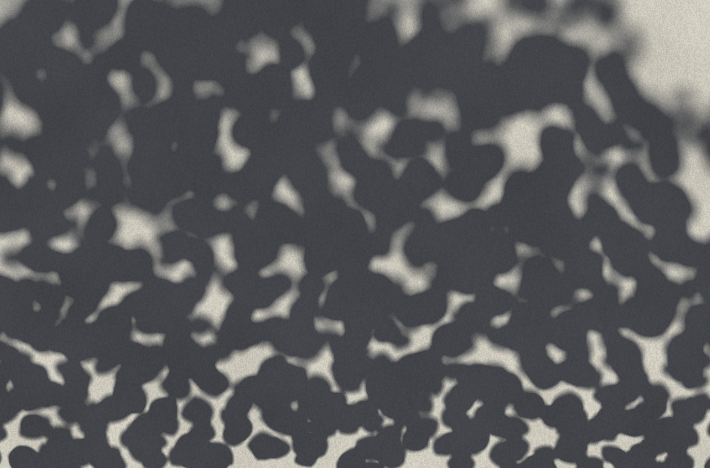

# Soft Shadows with windfoil

> 🤖 This document was primarily generated by LLM agents, with revisions by the author. See the README for more
> details on AI usage.

windfoil filters the winding number of a vector shape over each pixel's footprint, in closed form
([`ALGORITHM.md`](./ALGORITHM.md)) — and nothing in that integral depends on the filter being a one-pixel box.
Widen the footprint and it's a blur; **change the kernel** and it's whatever filter you like; and because both
the kernel's **radius and its shape** are just parameters the fragment plugs in, they can **vary per pixel**. A
soft shadow is exactly this: the occluder's silhouette convolved with the **light's disc**, at a radius that
grows with the occluder→receiver gap. So windfoil renders an **ideal, per-pixel-variable penumbra** — smooth
edge, sharp at contact, soft up high — with no blur pass, no shadow map, no SDF, no second sample.

---



_A dappled tree-canopy shadow, shadow only, cast on the ground and seen at a grazing angle. It's ONE silhouette
— the union of hundreds of small vector leaves (nonzero fill, so the gaps between leaves are the bright
sunflecks) — convolved with the **sun's disc** at a penumbra radius that grows from sharp at the bottom (near /
low foliage, contact) to soft at the top (far / high canopy). Rendered on the CPU by the analytic boundary
integral ([`tree-shadow.js`](../tools/tree-shadow.js) + [`kernel-coverage.js`](../src/kernel-coverage.js)); no
leaves are drawn, only their shadow._

## 1. A soft shadow is a blur of the silhouette

Take a flat occluder (a leaf) at height `h` above a flat receiver (the ground), lit by an area light of angular
radius `θ` (the sun is a disc ~0.27° in radius). At a receiver point, the fraction of the light the leaf blocks
is its **visibility integral** over the light's solid angle. For a planar occluder and receiver this integral is
exactly the occluder's silhouette **convolved with the light's projected shape**, and the width of that
convolution is the penumbra:

```
penumbra diameter  ≈  2 · h · tan θ          (grows linearly with the occluder→receiver gap)
```

Two consequences, both of them the signature of a real soft shadow:

- **Contact hardening.** Where the leaf touches the ground (`h → 0`) the penumbra vanishes and the shadow is
  razor-sharp; high leaves cast broad, diffuse shadows. The penumbra width is a *field* over the receiver, set
  by the local gap — not one global blur amount.
- **Detail washes out with distance.** A feature narrower than the penumbra (a twig, the gap between two leaves)
  can't cast a full-strength shadow — it dims toward the average. Convolution does this automatically.

So a soft shadow is not "a shadow, then blurred." It **is** the silhouette, filtered by a kernel whose width
varies per receiver point. That is exactly the object windfoil already computes — a filtered silhouette — with
one free parameter, the footprint width.

## 2. Widening the footprint

windfoil's coverage at a pixel is

```
coverage = ( 1/(sx·sy) ) · ∫∫_box  w(x,y) dA ,     box = rc ± s/2
```

with `s` the pixel's footprint in shape units. Nothing in the derivation ([`ALGORITHM.md`](./ALGORITHM.md) §2)
assumes `s` is one pixel. Evaluate it at `s_eff = s · (1 + b)` and you get the winding number averaged over a
box `b` device px wider — an **exact box blur of diameter `b`**, analytic, at any zoom, with no extra pass. The
[`NOTES.md`](./NOTES.md) "Box Blur" sketch is this idea; soft shadows are its application.

Because `b` is just a number the fragment plugs in, it can be **evaluated per pixel**:

```wgsl
let blurPx = clamp(I.blur.x + dot(I.blur.yz, rc - I.bbox.xy), 0.0, maxBlur);
let sEff   = s * (1.0 + blurPx);
// coverage = integrate_face(band, rc, sEff) / (sEff.x * sEff.y)
```

`blur.x` is the penumbra diameter at the shape's reference corner and `blur.yz` a gradient across the shape — a
**depth tilt**, so one leaf can be near the ground at one edge (sharp) and high at the other (soft), the penumbra
widening smoothly across its own shadow. `blur == 0` gives `sEff == s`: the exact 1px box filter, bit-for-bit
(text and the [`validate`](../tools/validate.js) suite are unaffected — the whole feature is off unless a shape
asks for it). See [`src/windfoil.wgsl`](../src/windfoil.wgsl) (the `fs` entry point) and the `blur` field of
`Instance`.

### Why this beats blurring the rendered image

A post-process blur operates on an already-rasterised bitmap: it is a blur of *samples*, at a fixed resolution,
and a spatially-varying-radius version has to gather neighbouring pixels — which leaks coverage across depth
discontinuities and doubles the filtering already baked into the AA. Widening the footprint instead integrates
the **ideal, resolution-independent vector silhouette** at each pixel's own radius:

- **No leaking.** Each pixel reads the geometry directly; there is no neighbour gather to cross a depth edge.
- **No double-filtering, no fixed resolution.** It's the true area-average of the shape, correct at any zoom —
  zoom into a soft shadow and the penumbra stays smooth, it doesn't pixelate.
- **Sub-penumbra detail is handled for free.** A stem thinner than the penumbra integrates to its true (dim)
  average; a gap between leaves narrower than the penumbra fills in — the physically-correct behaviour, straight
  out of the integral.

### The skirt: a fixed max, a per-pixel actual

One implementation detail matters. The penumbra reaches `maxBlur/2` device px past the ink, so two things must be
sized for the **maximum** blur even though the **actual** blur varies per pixel:

- the instance's quad is padded by `(1 + maxBlur)/2` device px (the vertex `padPx`), or the far penumbra clips;
- the fragment integrates curves up to `sEff.y/2` away in y, so it selects more row bands — automatic in
  `integrate_face`, which derives its y-slab from the footprint it's handed.

The **cost** scales with the *actual* footprint, not the max: a mostly-sharp shadow with a few soft patches
integrates only the bands and crossings its real radius touches. So you bound the geometry conservatively once
(widen the skirt) and pay per pixel only for the blur you actually asked for.

## 3. The kernel is the penumbra shape — use the sun's disc

Widening a **box** gives a *linear* penumbra ramp (C⁰). That's a real soft shadow and exactly right for a
uniform slit light, but it looks slightly flat and its dapples square off — the box was the problem in the first
cut of this demo. The sun is a **disc**, and the ideal 1-D penumbra is a disc's edge profile: a smooth S-curve
(the chord-length distribution of the circle). windfoil integrates *any* kernel, not just the box — the
[kernels/pluggable-filters branch](https://github.com/texel-org/windfoil/blob/kernels/pluggable-filters/docs/KERNELS.md) builds the general machinery (box, tent, Gaussian, Mitchell,
**disc**, iris…), each supplied as its **horizontal cumulative** `Φ(u,v)` and folded into the same
Green's-theorem boundary integral, `F = Σ_pieces ∫ Φ(u(t),v(t))·v′(t) dt`. The box is just the case
`Φ = clamp(u+½,0,1)`.

For shadows the kernel is the **uniform disc**, working in kernel units `u=(x−c)/rx`, `v=(y−c)/ry`:

```
Φ(u,v) = (clamp(u, −w, w) + w) / π ,   w = √(1 − v²)          # unit-mass disc; non-separable, closed form
```

Two moves turn that into a physical soft shadow, both just parameters of the same integral:

- **Variable radius.** Feed a per-pixel radius `r` (the disc's support) instead of a constant. `r` grows with
  the occluder→receiver gap, so the penumbra is razor-sharp at contact and wide up high — contact hardening,
  the thing a single global blur can't do. (In the ext gather this is exactly the box trick — the kernel scales
  with the footprint you hand it.)
- **Elliptical radius.** `rx ≠ ry` stretches the disc vertically, which is what a round sun looks like on a
  ground plane seen at a grazing angle. The `Φ` above already carries independent `rx, ry`.

This is what [`src/kernel-coverage.js`](../src/kernel-coverage.js) evaluates (the CPU twin of the ext gather,
specialised to the disc), and what renders the canopy image. A box needs no √ and is cheaper; the disc is the
one to reach for when the penumbra should look like sunlight.

## 4. Dappled light through a canopy

The dappled shadow under a tree is **one silhouette convolved with the sun's disc** — not many shadows
composited. The occluder is the whole canopy: the **union** of hundreds of small leaf contours, filed as one
windfoil shape under the nonzero rule, so overlapping leaves merge into solid foliage and the **gaps between
them are holes** in the silhouette. Convolve that with the variable-radius disc and both halves of the picture
appear at once:

- **The shadow** is the covered part — sharp-edged and leaf-shaped where the penumbra is small (near / low
  foliage), dissolving to soft broad pools where it's large (far / high canopy).
- **The dapples** are the holes. A gap *wider* than the local penumbra passes full sun; a gap *narrower* than it
  is closed over by the surrounding penumbra and **rounds off** — a hole smaller than the disc prints the disc's
  shape, not the hole's. Those are the round sun-dapples you see under a real tree: pinhole images of the sun.
  Because the kernel here *is* the sun's disc, they come out round for free.

The [`tools/tree-shadow.js`](../tools/tree-shadow.js) scene builds that canopy (a jittered grid of leaves so the
porosity is even, density-noise-modulated so the openings clump organically), foreshortens it for a grazing
view, and drives the penumbra radius from a field that's sharp at the bottom and soft toward the top. No leaves
are drawn — only the shadow they cast, as if you're looking at the ground under the tree.

## 5. The demo & tools

- [`tools/tree-shadow.js`](../tools/tree-shadow.js) (`deno task tree-shadow`) — the canopy above, rendered
  offscreen on the **CPU** by the analytic disc-kernel boundary integral
  ([`src/kernel-coverage.js`](../src/kernel-coverage.js)). No GPU required, so it runs anywhere and is how
  [`assets/shadow-canopy.png`](../assets/shadow-canopy.png) is made.
- [`tools/validate-shadow-kernel.js`](../tools/validate-shadow-kernel.js) (`deno task validate:shadow`) — checks
  the analytic disc coverage against an independent point sampler (ray-cast winding inside the disc, no shared
  math): a straight edge must give the disc's S-curve, a rim its convex profile, interiors saturate. Agreement is
  at the sampler's noise floor (~1e-3), round and stretched radii alike.
- [`demo/shadows/`](../demo/shadows/) — the interactive WebGPU piece: the live **variable-footprint** mechanism
  in the core shader (per-instance `blur`, §2), pan/zoom with the penumbra rescaled against the zoom each frame.
  It uses the box widening (the simplest kernel that runs guard-accelerated in the core shader); the disc kernel
  is the offline/ideal path above. `deno task serve`, then open `demo/shadows/`.
- [`tools/validate-blur.js`](../tools/validate-blur.js) (`deno task validate:blur`) — the box case: a step edge
  must give a linear penumbra of width exactly `1 + blurPx`, and `blur == 0` must be the exact 1px filter. Both
  hold to machine precision.

## 6. Honest limits

- **Planar model.** The penumbra-radius field is a designed function of position (a stand-in for the canopy's
  height above the ground), not a shadow solved between two arbitrary 3-D surfaces. It's the exact soft shadow of
  a *planar* occluder onto a *planar* receiver — the right model for a 2D scene and a convincing stylised canopy,
  not a general 3-D shadow renderer.
- **Per-pixel-constant kernel.** The radius is resolved once per pixel; where it changes very fast relative to a
  pixel that's a mild approximation (slow variation reads exact). The union silhouette also folds overlapping
  leaves by winding — internal leaf-on-leaf edges vanish (both sides are "inside"), which is what you want for a
  canopy, but it isn't a per-leaf transmittance stack.
- **Cost.** A soft pixel's disc spans many bands and many crossing pieces, and the disc's √ rim needs a few
  Gauss–Legendre samples per crossing — real fill-rate for a screenful of wide penumbrae. It scales with the
  *actual* radius, not the max (§2). The GPU path for a variable-radius disc is the composition of this note's
  variable footprint with the [kernels branch](https://github.com/texel-org/windfoil/blob/kernels/pluggable-filters/docs/KERNELS.md)'s disc `Φ` — the moonshot that doc calls
  "per-instance kernel parameters"; the CPU renderer here is that path's reference.
