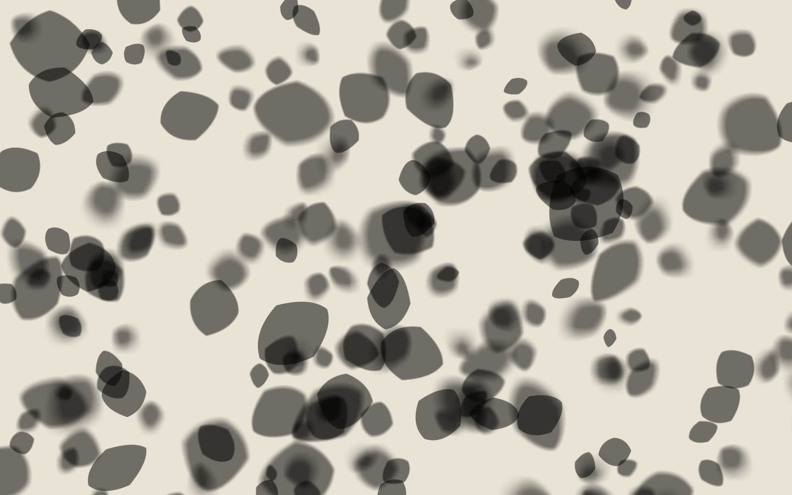

# Soft Shadows with windfoil

> 🤖 This document was primarily generated by LLM agents, with revisions by the author. See the README for more
> details on AI usage.

windfoil box-filters the winding number of a vector shape over each pixel's footprint, in closed form
([`ALGORITHM.md`](./ALGORITHM.md)). A box filter over a **wider** box is a box blur, and the width is just a
parameter of the same integral — so the exact same gather that anti-aliases a glyph will, at a wider footprint,
render a **soft shadow with an ideal, per-pixel-variable penumbra**. No blur pass, no shadow map, no SDF, no
second sample. This note explains why that works and how the [`demo/shadows/`](../demo/shadows/) canopy uses it.

---



_The shadow layer alone. Every blob is the same kind of vector leaf; the penumbra width is set per leaf by its
height and tilts across each one — sharp at the near edge, soft at the far — so low leaves read as crisp
silhouettes and high leaves as broad diffuse pools, all from one closed-form integral._

## 1. A soft shadow is a blur of the silhouette

Take a flat occluder (a leaf) at height `h` above a flat receiver (the ground), lit by an area light of angular
radius `θ` (the sun is a disc ~0.27° in radius). At a receiver point, the fraction of the light the leaf blocks
is its **visibility integral** over the light's solid angle. For a planar occluder and receiver this integral is
exactly the occluder's silhouette **convolved with the light's projected shape**, and the width of that
convolution is the penumbra:

```
penumbra diameter  ≈  2 · h · tan θ          (grows linearly with the occluder→receiver gap)
```

Two consequences, both of them the signature of a real soft shadow:

- **Contact hardening.** Where the leaf touches the ground (`h → 0`) the penumbra vanishes and the shadow is
  razor-sharp; high leaves cast broad, diffuse shadows. The penumbra width is a *field* over the receiver, set
  by the local gap — not one global blur amount.
- **Detail washes out with distance.** A feature narrower than the penumbra (a twig, the gap between two leaves)
  can't cast a full-strength shadow — it dims toward the average. Convolution does this automatically.

So a soft shadow is not "a shadow, then blurred." It **is** the silhouette, filtered by a kernel whose width
varies per receiver point. That is exactly the object windfoil already computes — a filtered silhouette — with
one free parameter, the footprint width.

## 2. Widening the footprint

windfoil's coverage at a pixel is

```
coverage = ( 1/(sx·sy) ) · ∫∫_box  w(x,y) dA ,     box = rc ± s/2
```

with `s` the pixel's footprint in shape units. Nothing in the derivation ([`ALGORITHM.md`](./ALGORITHM.md) §2)
assumes `s` is one pixel. Evaluate it at `s_eff = s · (1 + b)` and you get the winding number averaged over a
box `b` device px wider — an **exact box blur of diameter `b`**, analytic, at any zoom, with no extra pass. The
[`NOTES.md`](./NOTES.md) "Box Blur" sketch is this idea; soft shadows are its application.

Because `b` is just a number the fragment plugs in, it can be **evaluated per pixel**:

```wgsl
let blurPx = clamp(I.blur.x + dot(I.blur.yz, rc - I.bbox.xy), 0.0, maxBlur);
let sEff   = s * (1.0 + blurPx);
// coverage = integrate_face(band, rc, sEff) / (sEff.x * sEff.y)
```

`blur.x` is the penumbra diameter at the shape's reference corner and `blur.yz` a gradient across the shape — a
**depth tilt**, so one leaf can be near the ground at one edge (sharp) and high at the other (soft), the penumbra
widening smoothly across its own shadow. `blur == 0` gives `sEff == s`: the exact 1px box filter, bit-for-bit
(text and the [`validate`](../tools/validate.js) suite are unaffected — the whole feature is off unless a shape
asks for it). See [`src/windfoil.wgsl`](../src/windfoil.wgsl) (the `fs` entry point) and the `blur` field of
`Instance`.

### Why this beats blurring the rendered image

A post-process blur operates on an already-rasterised bitmap: it is a blur of *samples*, at a fixed resolution,
and a spatially-varying-radius version has to gather neighbouring pixels — which leaks coverage across depth
discontinuities and doubles the filtering already baked into the AA. Widening the footprint instead integrates
the **ideal, resolution-independent vector silhouette** at each pixel's own radius:

- **No leaking.** Each pixel reads the geometry directly; there is no neighbour gather to cross a depth edge.
- **No double-filtering, no fixed resolution.** It's the true area-average of the shape, correct at any zoom —
  zoom into a soft shadow and the penumbra stays smooth, it doesn't pixelate.
- **Sub-penumbra detail is handled for free.** A stem thinner than the penumbra integrates to its true (dim)
  average; a gap between leaves narrower than the penumbra fills in — the physically-correct behaviour, straight
  out of the integral.

### The skirt: a fixed max, a per-pixel actual

One implementation detail matters. The penumbra reaches `maxBlur/2` device px past the ink, so two things must be
sized for the **maximum** blur even though the **actual** blur varies per pixel:

- the instance's quad is padded by `(1 + maxBlur)/2` device px (the vertex `padPx`), or the far penumbra clips;
- the fragment integrates curves up to `sEff.y/2` away in y, so it selects more row bands — automatic in
  `integrate_face`, which derives its y-slab from the footprint it's handed.

The **cost** scales with the *actual* footprint, not the max: a mostly-sharp shadow with a few soft patches
integrates only the bands and crossings its real radius touches. So you bound the geometry conservatively once
(widen the skirt) and pay per pixel only for the blur you actually asked for.

## 3. From box to an ideal penumbra (kernel choice)

A uniform (box) kernel gives a **linear** penumbra ramp — already a genuine soft shadow, and exactly right for a
uniform slit light. The sun is a disc, whose ideal 1-D edge profile is a smooth S-curve (the chord-length
distribution of the disc), so "ideal penumbra" is a matter of the **kernel**, and windfoil integrates any
piecewise-polynomial kernel in closed form ([`NOTES.md`](./NOTES.md) "Filter Kernels"):

| kernel                 | penumbra ramp        | notes                                             |
| ---------------------- | -------------------- | ------------------------------------------------- |
| box (uniform)          | linear (C⁰)          | shipped here; a wider filter box, one extra clamp |
| tent (linear)          | quadratic (C¹)       | one extra x-zone per knot; visibly softer edges   |
| quadratic B-spline     | cubic (C²)           | box⊛box⊛box ≈ Gaussian — a strong sun-disc stand-in |
| polynomial fit to disc | the true disc S-curve | physically-exact sun penumbra                     |

Each raises the degree of the horizontal cumulative `Φ` the integral carries, staying closed-form per curve. The
demo ships the exact box blur; the softer kernels are the natural next step and share the whole gather. (The
existing `--sharp` / `--gamma` `style` uniform can also reshape the linear ramp perceptually toward an S-curve —
cheap, but a remap of coverage, not the exact kernel integral.)

## 4. Dappled light through leaves

The bright and dark structure on the ground under a tree falls straight out of the same model:

- **Soft shadows** are the dark side — the per-leaf penumbrae above, sharp under low leaves and broad under high
  ones, overlapping into deeper pools where the canopy is dense (transmittance multiplies as shadows composite
  over one another).
- **Dapples** — the bright spots — are the gaps between leaves. When a gap is *wider* than the local penumbra,
  full sunlight reaches the ground; when it's *narrower*, the surrounding penumbrae close over it and it dims and
  **rounds off**, because a gap smaller than the kernel prints the kernel's shape, not the gap's. With a round
  (disc) kernel these become the round sun-dapples you actually see under a canopy — a pinhole image of the sun.
  The box kernel here approximates them; the disc-fit kernel of §3 makes them exact.

## 5. The demo

- [`demo/shadows/`](../demo/shadows/) — the interactive canopy: hundreds of vector leaves over a ground plane,
  each an instance in the shared banded atlas, each casting an analytic soft shadow. Pan/zoom (the penumbra is a
  screen-space width, recomputed against the zoom each frame); sliders for the sun's softness, the shadow length,
  and the shadow density; a toggle for the leaf layer. Serve the repo root (`deno task serve`) and open
  `demo/shadows/`.
- [`tools/shadow-preview.js`](../tools/shadow-preview.js) — the same scene rendered offscreen to a PNG on the
  **CPU**, via [`src/cpu-coverage.js`](../src/cpu-coverage.js), a faithful JS twin of the fragment integral. No
  GPU required, so it runs in CI and is how [`assets/shadow-canopy.png`](../assets/shadow-canopy.png) is made.
- [`tools/validate-blur.js`](../tools/validate-blur.js) — checks the widening against the closed form: box-filtering
  a step edge must give a linear penumbra of width exactly `1 + blurPx`, and `blur == 0` must be the exact 1px box
  filter. Both hold to machine precision.

## 6. Honest limits

- **Kernel.** The shipped blur is a box (linear ramp). Physically the sun wants a disc kernel (§3) — implemented
  as tent / B-spline / disc-fit it's still analytic, but that's follow-up work, not in this demo.
- **Planar model.** The penumbra-width field here is a designed height/tilt per leaf, not a shadow cast between
  two arbitrary 3-D surfaces. It's the exact soft shadow of a *planar* occluder onto a *planar* receiver — the
  right model for a 2D scene, and a good stylised one for a canopy, but it is not a general 3-D shadow solver.
- **Overlap fold.** Where many leaves' shadows stack, coverage composites in painter's order (transmittance
  multiplies), which is plausible but not a true multi-occluder visibility integral. Within a single leaf the
  winding fold stays in its exact ≤2-level regime ([`ALGORITHM.md`](./ALGORITHM.md) §4).
- **Cost.** A blurred pixel integrates more bands and breaks later than a 1px one — the footprint is genuinely
  bigger. It scales with the *actual* penumbra, not the max (§2), but a screenful of very soft shadows is real
  fill-rate.
