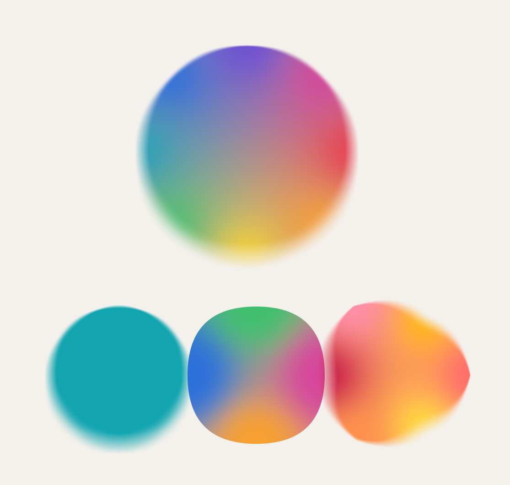

# Per-anchor color + blur

> 🤖 This document was primarily generated by LLM agents, with revisions by the author. See the README for more details on AI usage.

Windfoil fills a shape with one flat color and one crisp edge. This variant lets a single fill carry **two
continuous fields** instead — a **color** and a **blur** — each authored per on-curve anchor and blended
per pixel, independently of one another. One disc can run a whole hue wheel around its rim while its edge
goes from pixel-crisp at the top to a wide soft skirt at the bottom, and it is still the same
resolution-independent analytic vector graphic: no supersampling, no post-blur, no baked gradient.

It lives entirely in [`../src/windfoil-variable.wgsl`](../src/windfoil-variable.wgsl) (the fragment function)
plus a small scene builder ([`../src/variable.js`](../src/variable.js)) and its own offscreen renderer
([`../src/variable-gpu.js`](../src/variable-gpu.js)). The core box shader is untouched.

```sh
deno task render:variable      # the four-shape demo → output/windfoil-variable.png
deno task validate:variable    # color round-trip + blur-mass + scale-invariance checks
```



Left-to-right, bottom row: **blur only** (one teal, crisp top → soft bottom), **color only** (vivid OKLab
blend, edges as crisp as the box filter), and **both** on a wobbly blob. Top: a hue wheel that is also a
crisp→soft ramp — the interior blends toward the ring's mean, the organic mesh-gradient character a linear
gradient can't give you.

## Data

Two new pieces ride alongside the existing atlas — the geometry (monotone pieces, row bands) is filed exactly
like a glyph, so nothing about the gather structure changes.

- **Per anchor** (a parallel `anchors` buffer, two `vec4` each): a position in shape units, an OKLab color +
  straight alpha, and a `blur_scale` in `[0,1]`.
- **Per shape** (repurposed instance slot): `max_blur` (shape units), a Shepard `falloff` power, and the
  `[base, count]` range into `anchors`. Effective softness is `blur_scale · max_blur`.

Anchors are the shape's own on-curve points, so the field is decoupled from the curve/band structure (which
duplicates and splits pieces) — a clean 1:1 with a future per-point file format.

## Per-pixel field — a Shepard blend in OKLab

Each fragment blends the shape's anchors by an inverse-distance (Shepard) weight
`wᵢ = 1 / (dᵢ² + ε²)^(p/2)`, normalized, giving a per-pixel `(color, blur_scale, alpha)`:

```
color = Σ wᵢ·labᵢ / Σ wᵢ      blur_scale = Σ wᵢ·blurᵢ / Σ wᵢ
```

- **Smooth, not nearest.** The weight has no seam at anchor switch-over (hard-nearest would crack there);
  `ε` (a small fraction of the bbox diagonal) keeps it finite and pulls each anchor's value into a small
  neighborhood so the field reads as an organic blob-field. `falloff` `p` tunes it: higher → tighter
  per-anchor zones, lower → a flatter global average.
- **OKLab, not sRGB.** Blending happens in OKLab so midpoints stay bright and perceptually even — no muddy
  sRGB grays between complementary hues. The colors themselves scatter over the shape, so the result is a
  **mesh gradient**, not a ramp: this is what makes the color "more interesting than a linear gradient."
- **Independent axes.** Color and blur are separate anchor attributes blended by the same weights — a shape
  can be crisp-and-rainbow, soft-and-monochrome, or anything between.

Deep interiors of a large shape (all anchors far, roughly equidistant) blend toward the mean of the ring;
that flat center is inherent to scattered-point interpolation, tune with `falloff`/anchor placement.

## Blur = a wider box

Windfoil's coverage is the **box-filtered** winding number for box size `s` (one device pixel — the AA
footprint from `fwidth`). A wider box is an exact wider box blur ([`NOTES.md`](NOTES.md) § _Box Blur_), and the
per-piece integrand already takes the box size as an argument. So blur is just a **per-pixel box size**:

```
s_eff = s + blur_scale · max_blur      (shape units, isotropic)
F     = ∫∫_{s_eff box} w dA / area(s_eff)
```

No new integration path: `integrate_face`/`integrate_piece` are copied verbatim from the core shader and fed
`s_eff` instead of `s`. Because a taller `s_eff.y` selects more row bands and a wider `s_eff.x` reaches (and
breaks) later, the gather **widens itself** — the band additivity (ALGORITHM.md §6) that makes duplicated
pieces never double-count is unchanged. `max_blur` is in **shape units**, so the softness scales with the
shape: a shape drawn 2× larger has a 2× wider soft edge in pixels — resolution-independent like the rest of
windfoil (`validate:variable` measures the ramp at 1× and 2× and gets 2.000×).

Two knock-on changes, both mechanical:

- **Skirt.** The vertex quad pad grows by `max_blur/2` so the widened coverage ramp (which reaches
  `max_blur/2` past the ink at full blur) isn't clipped.
- **Reach.** Handled for free — the band y-slab and the x-hull early-break both read `s_eff`, so a blurry
  pixel already gathers the farther pieces its wide box straddles.

## Color out — texel/color parity via a uniform

Colors are authored in sRGB and converted to OKLab **once on the CPU** with [`@texel/color`](https://github.com/texel-org/color).
The shader converts the blended OKLab back to sRGB per pixel with the **same matrices**, handed in as a
uniform (`OKLab_to_LMS_M` and `LMS_to_linear_sRGB_M`, packed as `mat3x3`), with the cube nonlinearity and the
IEC sRGB curve between/after them:

```
OKLab → (okToLms) → LMS' → cube → LMS → (lmsToRgb) → linear sRGB → sRGB encode
```

Passing the matrices rather than hardcoding them keeps the shader color-space-agnostic — swap in the
DisplayP3 or Rec2020 matrices from the same library for a wide-gamut target. Because it mirrors the library
exactly, a flat single-color shape is **bit-identical** to the plain pipeline: `validate:variable`'s
round-trip (sRGB → OKLab on the CPU, OKLab → sRGB on the GPU) reproduces every test color to **0 of 255**
levels.

## Deliberately not accelerated

Like the [kernels branch](KERNELS.md), this shader carries **none** of the core's minification guard or
approximation tiers — it is the plain analytic gather at every size. Per-pixel it also runs the anchor loop
and, where blurred, a much larger band slab, so it is meaningfully slower than the core box shader and gets
slower still as heavier kernels drop in. That is the intended trade: this is for **static images**, not
realtime. The core `src/windfoil.wgsl` remains the fast, guarded, single-color path.

## Validation

`deno task validate:variable` ([`../tools/variable-validate.js`](../tools/variable-validate.js)) checks the
three things that are new over the core gather (the area integral itself is covered bit-for-bit by
`deno task validate`):

| check            | what it proves                                                                  | result         |
| ---------------- | ------------------------------------------------------------------------------- | -------------- |
| color round-trip | flat fills match their authored sRGB (OKLab uniform-matrix path == the library) | 0 / 255 levels |
| blur mass        | box widening conserves coverage (a box filter has unit mass)                    | ~0.001%        |
| scale invariance | blur authored in shape units ⇒ soft edge scales with the shape                  | 2.000× at 2×   |

## Limits

Inherited from the core (ALGORITHM.md §8): local-space filtering under rotation/shear, deep-zoom f32 edge
wobble, the winding-fold model at self-intersections. Specific to this variant:

- **Per-pixel-constant `s`.** The box size is resolved once per pixel from the local `blur_scale`; where blur
  changes very fast relative to a pixel this is a mild approximation (slow blur reads exact).
- **Holes with mismatched blur.** Nested contours with strongly different blur no longer share one filter and
  can fringe at the shared edge. Fine for single loops.
- **Out-of-gamut blends.** Blending two saturated OKLab colors can leave the sRGB gamut; the shader clamps
  per-channel on output (a slight hue shift at the extreme rather than an artifact). Author in-gamut anchors,
  or swap to a wider-gamut matrix set.

## Out of scope (for now)

Along-curve continuously-varying blur `s(t)`, non-box kernels (compose with [KERNELS.md](KERNELS.md)),
multi-shape compositing, and the **minimal per-anchor file format** this is groundwork for — a small SVG-like
format where each path point carries color/blur attributes, rendered by exactly this shader.
